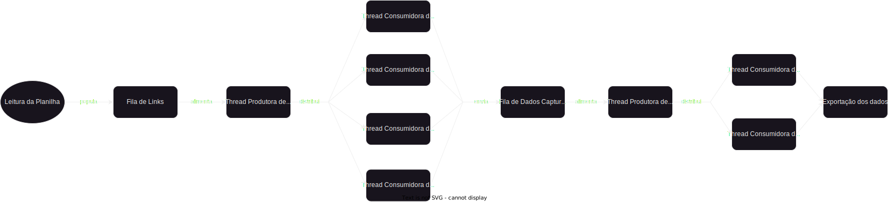

# mercadolivre-webcrawler

Este é um código em Python que coleta dados de anúncios do site Mercado Livre e os salva em um arquivo JSON. O programa utiliza a biblioteca Selenium para automatizar a navegação e extração de informações do site.

## Pré-requisitos
* Python 3.x instalado</br>
* Chromedriver
* Bibliotecas Python:
* * selenium
* * json

## Instalação
1. Faça o download ou clone este repositório em seu ambiente de trabalho.
2. Instale as bibliotecas necessárias usando o comando:
```
pip install selenium json
```
3. Certifique-se de ter o Chrome instalado em sua máquina.
4. Baixe o ChromeDriver compatível com a versão do Chrome instalada em sua máquina. O ChromeDriver pode ser baixado <a href="https://sites.google.com/chromium.org/driver/downloads">aqui</a>.
5. Extraia o arquivo ChromeDriver baixado e coloque-o no mesmo diretório do código fonte, ou nas variáveis do sistema.

## Uso
1. Abra o arquivo main.py em um editor de texto ou ambiente de desenvolvimento Python.
2. Execute o código Python.
3. Aguarde enquanto o programa coleta os dados dos anúncios. O programa irá navegar pelas páginas de ofertas do Mercado Livre e extrair informações como nome, vendedor, preço atual, preço anterior, desconto e link da imagem do anúncio.
4. O arquivo anuncios.json será gerado no mesmo diretório do código fonte, contendo os dados coletados no formato JSON, e o tempo de execução do programa será exibido no console.

## Observações
* O programa utiliza threads para coletar os dados dos anúncios de forma paralela e acelerar o processo. Neste caso, foram utilizadas duas threads para dividir a lista de anúncios e coletar os dados em paralelo. Após testes, verificou-se que o uso de quatro threads não apresentou um impacto relevante na velocidade do programa, por isso optou-se por usar apenas duas threads.
* O programa faz uso do navegador Chrome em modo headless para executar as operações de automação sem abrir uma janela do navegador visível. Se preferir ver a execução em tempo real, você pode remover a opção --headless nas configurações do Chrome.

## Sobre o Fluxograma
O fluxograma apresenta o processo de captura e processamento de informações de páginas da web. O problema abordado é a necessidade de resgatar dados de uma planilha contendo 5000 linhas, em que cada linha contém um link de página para capturar informações. Cada captura leva em média 2 minutos para ser concluída, o que resultaria em um tempo total de processamento de aproximadamente 166 horas se feito sequencialmente.

Para otimizar esse processo, o fluxograma propõe uma abordagem escalável usando threads e filas. O processo foi dividido nas seguintes etapas:

1. Leitura de Planilha: Nesta etapa, a planilha contendo 5000 linhas, cada uma com um link de página, é lida.

2. Fila de Links: Após a leitura da planilha, os links das páginas são armazenados em uma fila. Essa fila serve como fonte de dados para as Threads Produtoras de Links.

3. Thread Produtora de Links: Esta thread é responsável por consumir os links da fila de links e produzir tarefas individuais para cada link. Cada tarefa representa a captura de informações de uma página específica.

4. Threads Consumidoras de Captura: Essas threads consomem as tarefas produzidas pela Thread Produtora de Links. Cada thread é atribuída a uma tarefa e realiza a captura das informações da página correspondente. As threads consomem as tarefas em paralelo, o que permite capturar várias páginas simultaneamente e agilizar o processo.

5. Fila de Dados Capturados: Após a captura das informações das páginas, os dados capturados são armazenados em uma fila de dados capturados. Cada item da fila representa as informações de uma página específica.

6. Thread Produtora de Dados: Esta thread consome os itens da fila de dados capturados e realiza o processamento adicional necessário nos dados. Por exemplo, pode-se calcular valores totais ou aplicar formatação especial.

7. Threads Consumidoras de Processamento: Essas threads consomem os itens da fila de dados processados e executam o processamento adicional necessário em paralelo. Cada thread é responsável pelo processamento de um item da fila, permitindo que várias páginas sejam processadas simultaneamente e reduzindo o tempo total de processamento.

8. Exportação dos Dados: Após o processamento, os dados são exportados para um formato desejado, como um arquivo JSON. Essa etapa finaliza o processo de captura e processamento das informações das páginas.



O diagrama foi criado em formato SVG, utilizando uma ferramenta de edição de gráficos, é recomendado que baixe o arquivo para uma melhor visualização.